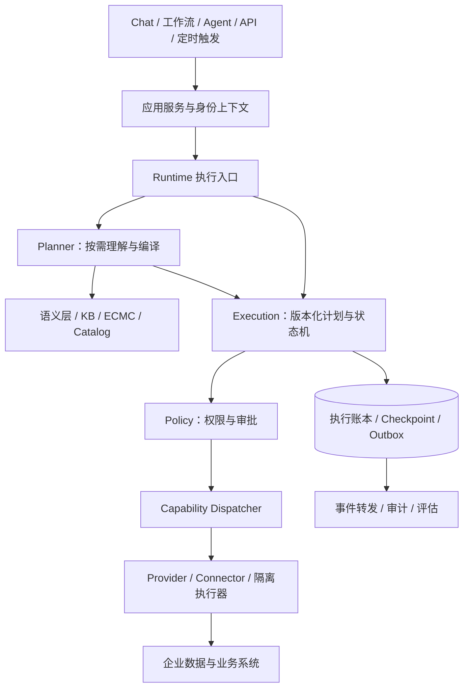

# EARP 架构分析与演进建议

评审日期：2026-09-05。基于当前工作区，HEAD 为 `bb5f27e`，包含已有未提交改动；本次只新增评审报告，不修改业务实现。以下优先级是本次评审建议，不代表既有项目排期。

**总体判断：EARP 的产品抽象具有价值，当前最需要投入的是执行内核的可靠性、架构契约的收敛和真实场景交付。继续保留模块化单体与 PostgreSQL 主存储，通过进程隔离和明确契约演进。现有代码与局部验收证据不足以支持“生产级企业 AI 操作系统已经完成”的判断。**

**1．设计目的：从企业能力治理，发展到企业知识与经验的可执行化**

[L0 设计哲学](/Users/linkunpeng/work/EARP/arch/L0/design-philosophy.md:13)关注企业集成、编排、治理和审计：把业务动作定义为 Capability，让 Chat、Workflow、Agent 共享执行生命周期。其真正价值是让业务系统接入一次后，可以被不同 AI 应用安全、可追踪地复用。

[ECMC 设计](/Users/linkunpeng/work/EARP/arch/design/2026-08-28-enterprise-cognitive-model-center-design.md:16)进一步把专家经验变为版本化资产。它与原有架构的关系可以归纳为：

| 层面 | 解决的问题 | 应承担的责任 |
|---|---|---|
| 企业语义层 TBox | 企业中的概念、属性、指标分别是什么 | 统一词汇、单位、口径、关系类型 |
| KB / ABox | 当前和过去发生了什么 | 文档、实体事实、来源、时间与权限 |
| ECMC | 哪些业务规律可以解释现象 | 因果假设、决策知识、适用范围、版本和验证记录 |
| Catalog / Binding | 所需数据和能力到哪里取得 | 契约、来源、绑定、兼容性与依赖状态 |
| Planner / Blueprint | 此次问题需要执行什么步骤 | 选择模型、解析依赖、生成可验证计划 |
| Runtime / Capability | 如何可靠地完成步骤 | 权限、审批、执行、重试、补偿、审计 |

这是一个有区分度的方向。建议对外定位优先围绕“可治理的企业诊断与行动平台”，首期用生产异常诊断等具体问题证明价值。评价平台时，应关注定位原因的时间、有效建议比例、接入一个数据源所需时间和业务动作正确率。

L0 中“LLM 占 20%”“路由准确率由不到 60% 提升到 95% 以上”未在本次读取范围内看到实验依据，应标为假设或补数据集、测量方法与适用范围。比较其他平台时，也应针对具体版本和场景，避免把早期市场判断变成永久架构前提。

**2．值得保留的设计，以及需要修订的原则**

值得保留：Capability 业务语义封装；Query/Command 分离；推理与执行职责分离；Policy/Audit 横切治理；RLS 租户隔离；ECMC 模型快照、编译、版本绑定与证据追踪；模块化单体和任务队列适配层。

但建议调整若干过于绝对的表述：

- “执行不能失败”应改为“失败必须可识别、可恢复、可对账”。外部系统超时和部分成功是正常状态，不能仅用 failed/rolled_back 抹平。
- “所有 Command 必经审批”宜解释为所有 Command 必须经过审批策略判定。高风险操作需要明确人工授权；低风险、可撤销动作可在预授权额度内自动放行，保留依据和审计。
- Query/Command 分类不意味着必须建设两套数据库或采用完整事件溯源。先实现副作用契约、权限差异和不同的重试策略。
- “无状态 Runtime”应落实为重启后无需依赖旧进程内存即可恢复。仅将部分状态写入数据库还不够。
- “所有模块经事件通信”不宜用于每次权限检查、参数校验和数据查询。同步接口承载明确请求结果，异步事件承载通知、衍生计算和跨进程传播。
- “持续学习”应变为反馈→离线评估→候选版本→审核/灰度→发布→可回退。生产执行不能直接改写已发布专家规则或权限策略。

**3．技术架构：收敛执行入口，保留模块化单体**

[ADR-007](/Users/linkunpeng/work/EARP/arch/design/ADR-007-modular-monolith.md:13)采用模块化单体与一份代码多个进程角色，这一选择仍然合适。Reasoning、Execution、Coordination 是职责边界，不必立即映射成独立网络服务。

建议的逻辑结构如下；图中的模块均可先位于同一代码库和应用包中：

明确 Capability 的调用可直接进入计划校验与执行，无需每次经过 LLM 理解。普通知识问答也应享有统一的执行上下文、数据权限和审计，但不必付出重型业务事务编排的全部成本。

当前治理路径尚不完全一致。例如 [StepRunner.invoke](/Users/linkunpeng/work/EARP/apps/earp-server/src/earp_server/orchestrator/step_runner.py:32)运行 Layer、写 checkpoint；同类中的 [stream](/Users/linkunpeng/work/EARP/apps/earp-server/src/earp_server/orchestrator/step_runner.py:97)直接调用 LLM 或适配器，没有复用同一套 Layer/checkpoint 过程。Chatflow 又由 conversation 直接组织 executor。建议建立一份调用路径矩阵，覆盖 HTTP invoke、Chat、Chatflow、stream、MCP、定时任务、重试与补偿，逐条证明身份、权限、审批、输出过滤和审计的一致性。这里指出的是内部接口语义差异，未声称每条路径都存在可利用的外部绕过。

统一执行契约建议至少包含：tenant、actor、有效权限、execution/step、逻辑幂等键、Capability 版本、参数摘要、审批凭据、截止时间、追踪标识。Context 使用不可变值对象，避免因嵌套调用或重试混用角色、Step 与租户。

**4．优先修复的可靠性与治理问题**

以下发现来自当前源码；其中 A—D 做了不依赖生产服务的行为探针。

| 编号 | 优先级与发现 | 依据、影响与建议 |
|---|---|---|
| A | P0：非明确同意也被当成审批通过 | [_is_reject_reply](/Users/linkunpeng/work/EARP/apps/earp-server/src/earp_server/orchestrator/multi_step.py:41)仅匹配拒绝词，[恢复分支](/Users/linkunpeng/work/EARP/apps/earp-server/src/earp_server/orchestrator/multi_step.py:406)据此授予 approval_granted。探针中“请解释风险”“稍等”和空串均进入非拒绝分类。应使用明确 approve/reject 操作，绑定审批人权限、execution、step、参数 hash、版本和有效期，并原子消费一次。空串探针证明分类器语义，不代表所有外部接口都接受空消息。 |
| B | P0：审计提前 ACK，且存在不可持久降级 | [Redis consumer](/Users/linkunpeng/work/EARP/apps/earp-server/src/earp_server/infra/redis_eventbus.py:123)先向内存 EventBus 投递，再立即 XACK；处理器在异步任务中写库。探针观察到 ACK 先于处理器完成。发布端又是 create_task，Redis 故障降为内存；生产 API 没有本地审计订阅兜底。应采用事务 Outbox、稳定 event_id、写库成功后 ACK、幂等消费、pending 回收及死信处理。 |
| C | P0：checkpoint 写入与读取格式不兼容 | [_serialize_results](/Users/linkunpeng/work/EARP/apps/earp-server/src/earp_server/orchestrator/multi_step.py:743)写 JSON，而 [_read_prior_results](/Users/linkunpeng/work/EARP/apps/earp-server/src/earp_server/orchestrator/multi_step.py:709)用 ast.literal_eval，失败返回空结果。带 true/null 的合法 JSON 会被拒绝，探针已复现。应使用带 schema_version 的 JSON codec；未知/损坏格式阻断恢复，旧格式显式迁移，禁止静默从头执行。 |
| D | P0：补偿失败仍可能报告回滚成功 | [SagaCompensation.rollback](/Users/linkunpeng/work/EARP/apps/earp-server/src/earp_server/orchestrator/compensation.py:24)捕获错误后清空补偿列表，执行器随后设置 [ROLLED_BACK](/Users/linkunpeng/work/EARP/apps/earp-server/src/earp_server/orchestrator/multi_step.py:256)。探针确认失败未向调用方传播。应持久化逐项补偿结果，保留 compensation_failed/manual_intervention 状态，支持重试、人工处理和下游核对。 |
| E | P1：外部副作用与 checkpoint 间有重复执行窗口 | [StepRunner](/Users/linkunpeng/work/EARP/apps/earp-server/src/earp_server/orchestrator/step_runner.py:40)先执行外部动作，再写 checkpoint。若下游已成功而本地写入失败，恢复可能重做。需要持久 StepAttempt、稳定幂等键和下游结果查询；无法确认结果时标为 unknown，先对账。数据库事务不能原子覆盖任意外部 API。 |
| F | P1：checkpoint 先保存原始输出，再做输出过滤 | [StepRunner](/Users/linkunpeng/work/EARP/apps/earp-server/src/earp_server/orchestrator/step_runner.py:61)写 raw_output 在 after_step 之前。普通用户输出权限与原始证据访问权限必须分开；原始产物应加密、限制读取并单独设保留期。不能把界面已脱敏推导为底层存储已脱敏。 |
| G | P1：恢复流程缺少明确抢占契约 | [flow_runs](/Users/linkunpeng/work/EARP/apps/earp-server/src/earp_server/conversation/flow_runs.py:57)读取 waiting_human 与后续执行不是一个原子领取操作；当前服务中未见执行租约/CAS。两个恢复请求可能竞争执行，应增加状态版本、原子领取、lease、超时回收及陈旧 worker 写入拒绝，并用并发集成测试验证。 |

P0 在此表示放开真实 Command 和生产可靠性承诺前应完成的门槛，不等于本次已观察到线上事故。E/G 的故障后果是基于调用顺序的风险判断，尚未进行真实企业接口与多进程故障注入。

审计推荐采用至少一次投递与消费者去重，业务表与 Outbox 同事务提交，转发器失败后重试。保留原始 CloudEvent id/time；当前 Redis payload 未携带 event.id，消费时重建事件会产生新 ID，不利于去重与溯源。ACK 与 pending 回收机制可参考 [Redis 官方消费示例](https://redis.io/docs/latest/develop/use-cases/streaming/redis-py/)及 [XAUTOCLAIM](https://redis.io/docs/latest/commands/xautoclaim/)。

此外，checkpoint_blobs 当前固定 version='1' 并覆盖同命名空间内容，建议改为不可变版本或内容寻址，保证旧 checkpoint 始终指向当时的数据。[CheckpointStore](/Users/linkunpeng/work/EARP/apps/earp-server/src/earp_server/infra/checkpoint.py:53)中的覆盖写不能直接提供任意历史版本回放语义。

长期流程引擎有两条合理路线：短流程、有限审批继续强化现有 executor；若跨天等待、并行子流程、升级中的恢复和复杂补偿成为核心，再做 Temporal 后端适配 PoC，以同一故障验收集比较运维与研发成本。[Temporal 的持久执行机制](https://github.com/temporalio/documentation/blob/main/docs/encyclopedia/architecture/how-temporal-works.mdx)可作为候选参考；采用它也仍需约束外部活动的幂等性。

**5．性能：先定位成本和关键路径，再决定并行与拆库**

本次没有生产负载、SQL 执行计划或端到端压测，不能给出已达到的 QPS、延迟或硬件容量。文档里的时延例子和早期 100 个队列任务 spike 不应外推为当前端到端容量。

当前有明确可检查的热点：

| 热点 | 当前证据 | 建议 |
|---|---|---|
| 文档导入占用 API 请求链路 | [main._index_document](/Users/linkunpeng/work/EARP/apps/earp-server/src/earp_server/main.py:1083)串起建文档、分块、embedding 和路由索引 | 入库与任务入队同事务，返回 job_id；worker 分阶段处理、批量 embedding、记录进度、可取消和重试。平台已有队列，应优先复用。 |
| 图描述与实际并行不同 | [MultiStepExecutor.execute](/Users/linkunpeng/work/EARP/apps/earp-server/src/earp_server/orchestrator/multi_step.py:145)明确顺序执行 | 增加依赖就绪队列，对无依赖 Query 做有界并行；对 Command 设置资源冲突键与顺序约束。若五个查询各耗时 t，理想外部等待可由约 5t 接近 t，实际收益须计入配额与调度开销。 |
| 中文关键词扫描 | [_text_lane](/Users/linkunpeng/work/EARP/apps/earp-server/src/earp_server/knowledge/search_service.py:151)使用 position(lower(keyword) in lower(content)) | 先 EXPLAIN ANALYZE，评估租户过滤后扫描量；改为可索引的候选召回，再精排。可验证 pg_trgm + 匹配查询重写；中文短词、分词效果和召回质量另测。 |
| 向量检索与 OLTP 共享数据库 | 当前 migrations 中未搜索到 hnsw/ivfflat 建索引语句 | 先测现有精确搜索基线；根据数据量添加合适索引。不能仅增加索引而忽略租户、KB、权限过滤下的 recall@k。未见迁移不代表运行库没有人工建立索引。 |
| 数据库往返和写放大 | StepRunner 与 executor 可重复写节点/计划 checkpoint；部分权限信息重复查询 | 确认唯一权威状态记录，合并同事务写入；权限数据可在单次执行中做版本化快照，并在副作用前重新验证失效条件。 |
| API 与后台争用连接/模型额度 | [build_engine](/Users/linkunpeng/work/EARP/apps/earp-server/src/earp_server/infra/db.py:29)未显式配置池预算；队列也有自己的池 | 为 API、worker、audit、scheduler 分配连接和并发预算；按副本数计算总连接上限。LLM/embedding/数据源分别限流，增加租户公平队列。 |
| HTTP 与同步文件操作 | connector 多处逐调用构造 AsyncClient；FileDataset 在异步路径同步读 CSV | 复用按 Provider 配置的 HTTP 客户端；解析与大文件 I/O 移至 worker/线程，设置超时、批量与文件大小边界。 |

pg_trgm 的 GIN/GiST 支持 LIKE/ILIKE 等匹配，但不会自动优化现有 position 表达式，需相应改写并验证索引计划。[PostgreSQL 16 文档](https://www.postgresql.org/docs/16/pgtrgm.html)

pgvector 官方明确指出近似索引与过滤可能导致结果不足，并提供迭代扫描选项；应先确认部署扩展版本，测量强租户过滤、小 KB 和大 KB 下的召回率。[pgvector 官方说明](https://github.com/pgvector/pgvector)

建议按查询、问答、诊断、Command、批量导入五类建立基准，记录 p50/p95/p99、首 token 延迟、排队时间、关键步骤耗时、token/费用、错误率、内存、连接等待。用 1×/10×/100× 数据规模和“一个大租户压住其他租户”的场景压测。初期目标可讨论为：不含模型与外部系统耗时的管理 API p95≤300ms、审计落库 p99≤5s、重复恢复不产生重复业务副作用；这些是候选验收目标，须根据硬件、合同和场景校准。

**6．部署架构：把远期拓扑改成可选演进路径**

[部署设计](/Users/linkunpeng/work/EARP/arch/L1/deployment-architecture-v1.md:14)中的完整 K8s/Istio/多服务拓扑是目标态。[ADR-007](/Users/linkunpeng/work/EARP/arch/design/ADR-007-modular-monolith.md:16)说明了当前采用单体的原因。建议明确三个可交付档位，避免把微服务数量当作成熟度。

| 档位 | 推荐形态 | 进入下一档的条件 |
|---|---|---|
| 开发/演示 | API、worker、scheduler、audit 可按需启动；PG/Valkey；文件本地存储适配器；可重复 demo seed | 一条真实端到端流程可由新机器稳定启动和重现 |
| 首个生产部署 | 同一镜像按角色运行；API 按可用性要求多副本，执行/导入 worker 分池；PG 备份与恢复、持久对象存储、TLS 入口；scheduler 单活或有锁 | 有扩容压力、可用性隔离需求或明确合规要求 |
| 规模化/强隔离 | 以资源特征和信任边界拆进程/服务；重点租户独立数据库或执行池；需要时再引入 K8s、Service Mesh | 可由故障影响范围、利用率、租户 SLO 和团队运维能力证明收益 |

当前仓库文件检索只发现开发用 docker-compose，未发现可运行的 EARP Dockerfile/Helm/生产 Deployment 文件；这只能说明仓库内交付物缺口，无法判断外部部署仓库的情况。应补充可复现镜像、数据库迁移 job、角色启动命令、配置验证、健康检查、优雅停止和回滚演练。

开发 compose 的 PG/MinIO 未声明显式命名数据卷；数据库端口写为 `5433:5432`，与注释“仅 localhost”不一致。MinIO 与部分镜像未锁定 digest；Langfuse 3 依赖缺口已在 Makefile 中明确说明。建议生产模板与开发模板分开交付，开发端口显式绑定 127.0.0.1，生产使用独立密钥与持久卷，观测组件提供可用 profile。

[FileDataset](/Users/linkunpeng/work/EARP/apps/earp-server/src/earp_server/file_dataset.py:262)把元数据存 PG、CSV 存相对本地目录。多副本时“上传到实例 A，在实例 B 执行”会成为问题。生产应使用对象存储接口保存不可变内容，PG 保存 object key、hash、版本与状态；本地适配器保留给开发。单独恢复 PG 无法恢复对应 CSV，应执行数据库与对象存储联合恢复校验。

RLS 解决行访问隔离，namespace/独立数据库解决另一层资源与信任隔离；两者都不能替代租户配额、连接预算和应用身份验证。RPO/RTO 必须由备份恢复演练证明，不能只依据部署图中的副本数。

**7．数据存储：保留 PG 中心，明确权威来源与不可变性**

PG + pgvector 是当前合理起点。状态、权限、模型、元数据和任务需要事务；当前类型级因果图可以从版本化快照加载到内存计算，没有充分证据要求立即新增图数据库。

建议把数据划为以下几类，并各自指定负责模块：

| 数据 | 权威来源与存储建议 |
|---|---|
| 企业原始业务数据、指标计算 | ERP/MES/数据平台保持权威；EARP 保存契约、来源、窗口、快照引用，按需要缓存 |
| 身份、Capability、模型、Catalog、发布版本 | PG，核心查询字段关系化，灵活结构 JSONB，发布对象不可变 |
| Execution、StepAttempt、Approval、Outbox | PG，同步持久化关键状态，乐观锁/租约；中间件缓存不作为唯一事实 |
| 文档、CSV、原始证据、大 checkpoint blob | S3 兼容对象存储，PG 存元数据与 hash；分级权限、保留和加密 |
| embedding、摘要、语义索引 | 可重建的派生数据；标明 embedding 模型、维度和索引版本 |
| 缓存、限流、短期通知 | Valkey/Redis；明确故障降级语义，持久审计不能降级为无人处理的内存事件 |
| Audit/Trace | 按访问和保留策略分热冷数据，量大后按时间分区/归档，敏感 payload 与普通指标分开 |

已有 [tenant_session](/Users/linkunpeng/work/EARP/apps/earp-server/src/earp_server/infra/db.py:49)通过参数化 set_config 在事务内设置租户，这是应该推广的默认路径。逐步替换散落的 SET LOCAL 字符串拼接，并增加结构检查：新租户表必须有 RLS/合适索引，运行角色不能是 superuser/BYPASSRLS。PostgreSQL 的表所有者与特权角色有绕过规则，不能仅凭 tenant_id 列存在就认定隔离完成。[PostgreSQL RLS 文档](https://www.postgresql.org/docs/17/ddl-rowsecurity.html)

在事实层明确 valid_time（业务有效时间）与 recorded_at（系统获知时间），避免“当前查到的数据”被当作历史时点已知的事实。业务指标应包含单位、时区、聚合口径、缺失语义和来源版本；缺失、零值、无权限和上游故障不能混为一类。

缓存键建议包括 tenant、权限范围版本、Provider、模型配置版本、Prompt/计划版本及输入摘要。当前 [LLMCache](/Users/linkunpeng/work/EARP/apps/earp-server/src/earp_server/infra/llm_cache.py:56)基础键是 model+prompt，Planner 调用额外纳入 capability 内容，但没有统一租户和权限上下文契约；这是一项应在全调用面修正的设计风险，不是已证实跨租户泄露。内存 fallback 还应设容量上限和失效清理。

模型配置还应统一按当前租户解析。[main 启动过程](/Users/linkunpeng/work/EARP/apps/earp-server/src/earp_server/main.py:635)从 tenant-demo 读取默认模型并注入全局 llm/embedding/reranker；虽然 Chat 已有应用→租户默认模型的覆盖逻辑，回落到全局实例的路径仍需逐一核对。建议使用 tenant+配置版本的 Provider factory，区分平台公共默认与某租户私有默认；模型不可用/凭据失效时按策略报错，不能静默转到其他租户供应商。embedding 模型切换还必须触发索引版本迁移，而非只热替换调用配置。

**8．ECMC 与可拓展性：模型可解释，还必须证明有用**

ECMC 的优势在于把模型、观测、编译产物和证据分开，并将执行交给 Runtime。建议继续维护这种边界，新增算法只实现推理输入输出契约，不直接掌握 Connector、审批或状态机。

[因果推理设计](/Users/linkunpeng/work/EARP/arch/design/2026-08-28-causal-reasoning-engine-l3-design.md:619)的 Phase 1 是符号传播与路径排序，score 使用 strength/confidence/观测匹配的组合。它表达“在已给定专家模型下，哪些解释更符合观测”。未经校准的分数不宜显示为真实概率；也不能把符合一条图路径的相关观测直接当作因果关系已被证明。

建议在模型中维护适用对象、时间范围、已知假设、反例、证据出处与不适用条件；输出分开呈现原因排序分、证据覆盖率和数据质量。数据缺失或关键证据冲突时应能弃答、请求补数或转人工。为图算法限制节点/边数、深度、路径数和运行时间，防止路径枚举放大。

2026-08-30 的 [Case A 验收](/Users/linkunpeng/work/EARP/arch/acceptance/2026-08-30-case-a-causal-diagnostic-acceptance-report.md:1)明确只覆盖 Fixture/mock Provider，且未验证性能、并行调度和真实企业 Provider。当前工作区已经增加 CSV FileDataset，这是实际推进，不能仍简单归类为“只有 mock”；但本次也没有看到足以证明实时生产数据接入和真实案例泛化的结果。

下一次验收建议选一个真实只读数据源，使用按时间划分、专家盲评的历史案例，覆盖正确原因、相似干扰、缺失数据、冲突证据与模型不适用。比较 RAG-only、规则基线、ECMC 三种方法的原因 Top-k 命中、证据充分性、误报、弃答和诊断耗时。只有证明增量收益后，再扩展 Decision/Scenario 资产范围。

可拓展性的核心是稳定业务契约：Capability schema、语义版本、输入输出兼容性、权限、幂等、超时、健康状态和成本声明；Industry Pack 应携带依赖清单、迁移规则、验证用例及兼容范围。当前 [Connector.execute](/Users/linkunpeng/work/EARP/apps/earp-server/src/earp_server/connector.py:148)不断增加 if 分支，应演进为注册式 Dispatcher + Provider Protocol。为固定 adapter_type 保留兼容适配，逐个迁移。

插件需区分管理员受信代码与租户提交的不受信代码。[Plugin Daemon](/Users/linkunpeng/work/EARP/apps/earp-server/src/earp_server/entrypoints/plugin_daemon.py:42)明确依赖受信目录和外层容器隔离；同步方法在线程中执行，超时不能证明业务动作已停止。运行中的线程任务不能靠 Future 取消强制终止。[Python 文档](https://docs.python.org/3.12/library/concurrent.futures.html)不受信代码需要独立执行单元、网络/文件/资源限制、最小凭据和方法白名单。[插件 installer](/Users/linkunpeng/work/EARP/apps/earp-server/src/earp_server/plugin/installer.py:15)下载和校验仍是 stub，产品界面与成熟度声明应体现这一点。

**9．技术栈与代码组织：渐进拆模块，避免整体重写**

本次统计：服务端 160 个 Python 文件、约 3.66 万行；90 个测试文件、约 2.12 万行；47 个迁移文件；管理端 42 个 HTML 页面。代码量是维护范围证据，不是质量评分。

| 选择 | 建议 |
|---|---|
| Python / FastAPI / asyncio | 保留。适合现有 I/O 密集集成与 AI 生态；CPU 密集计算和解析移出 API 事件循环。没有证据支持整体改写为 Go/Java。 |
| SQLAlchemy + psycopg + Alembic | 保留。集中租户事务、连接预算与迁移规范；不必强迫复杂 SQL 全部改 ORM。 |
| Procrastinate | 保留并完善适配。enqueue_in_session 已提供事务入队；其直接写队列表实现需锁定与验证兼容性。[task(max_attempts)](/Users/linkunpeng/work/EARP/apps/earp-server/src/earp_server/infra/task_queue.py:95)目前直接传 retry=max_attempts，与 ADR 所写总尝试次数映射不一致，应加契约测试统一。 |
| Langfuse / OTel | 保留可插拔性，LLM tracing 之外还需执行、队列、DB 与 Provider 的 trace 关联。审计与调试 tracing 使用不同权限和保留策略。 |
| HTML/JS、局部轻量交互 | 简单页面可保留；ECMC 编辑器、Chatflow、权限配置等复杂页面逐步引入 TypeScript、组件化和显式状态管理。没有必要一次重写全部页面。 |
| uv/ruff/pyright/import-linter/Testcontainers | 已有较好基础。发布和 CI 使用锁定依赖；类型检查应逐步缩小全局关闭的规则范围，重点约束 Step、Observation、Approval 和 Provider 边界。 |

当前 [main.py](/Users/linkunpeng/work/EARP/apps/earp-server/src/earp_server/main.py:1)为 2092 行，connector.py 为 1084 行，chat_service.py 为 886 行。优先把 main 收敛为 composition root，业务路由与应用服务移回领域；Connector 拆 Dispatcher、LLMProvider 和具体 Adapter；conversation 保留会话语义，可靠执行归 Runtime。

现有 [import-linter](/Users/linkunpeng/work/EARP/apps/earp-server/pyproject.toml:81)只有一份 independence 契约，列出 12 个早期模块，并有多项 ignore_imports。ontology、catalog、bmc、causal_model_management、file_dataset 等新模块未列入同一独立性契约。此次 lint 通过证明既有规则满足，不证明整个新增架构已经解耦。

建议新建少量明确契约：领域不得依赖 FastAPI；domain model 不依赖 infra；推理只能经 Provider 接口取观测；Capability 不依赖 conversation；UI/API 不直调具体 Adapter。合法依赖声明为 ports，而非持续扩充 ignore_imports。每项例外应有原因、负责人和移除条件。

五个 Python SDK 暂不合并发布包，但应提供统一 quickstart、版本兼容矩阵、公共 schema 来源和一条端到端示例。未来多语言优先基于稳定 OpenAPI/协议生成客户端，避免过早复制完整 Runtime 实现。

**10．易用性：降低“必须理解整个平台才能完成一次任务”的门槛**

建议围绕三种角色组织界面：业务用户完成问答、查看证据和审批；FDE 完成数据绑定、模型验证与发布；平台管理员完成租户、权限、模型供应商和部署配置。

FDE 的默认路径应为：选择场景模板→接入数据→映射口径→检查依赖→试跑历史案例→查看证据缺口→提交发布。TBox、ABox、Snapshot、CompileRecord、Binding 等技术概念按需展开，避免让用户在多个中心之间推断操作顺序。

审批卡片必须明确对象、参数、将产生的变化、预计影响、审批人和有效期；“继续解释”与“批准执行”是两个不同操作。执行界面应明确区分排队、运行、等待审批、部分完成、补偿失败、待人工处理。

错误处理应返回稳定错误码、用户可理解的原因和修复入口。例如“指标没有数据”应区分未绑定、时间窗无记录、无权限、来源不可用、口径版本失效。用户可一键定位相应配置，而非阅读底层异常。

开发者体验方面，根 README 目前只有简介，应补最小启动、示例数据、第一条 Capability、第一条诊断、测试命令、支持范围与已知限制。现有浏览器请求工具有本地 API 自动探测和单独 SSE 解析；生产应固定同源配置，统一鉴权过期、HTTP 错误和流中错误处理，支持取消和断线后查询 execution 状态。

**11．实施顺序与验收门槛**

以下阶段按交付风险排序，不承诺未经估算的人天数。

| 阶段 | 应交付的结果 | 验收标准 |
|---|---|---|
| 第一阶段：建立可信执行门槛 | 修复 A—D；统一 checkpoint codec 与补偿状态；明确审批凭据 | 模糊回复不执行 Command；审计 DB 故障不提前 ACK；合法 JSON 均可恢复；补偿失败不得标成功 |
| 第二阶段：完成一个生产纵向场景 | 真实只读 Provider→ECMC→证据结果；持久执行账本、Outbox；文件共享存储；可重复部署 | worker 重启、重复提交、Provider 超时、Redis 故障后结果可解释、可恢复、可对账；全链路租户隔离 |
| 第三阶段：控制性能与维护成本 | 导入后台化、Query 有界并行、SQL/向量基准、连接与模型预算；新增模块契约 | 用目标数据量和并发证明 SLO；新模块违规依赖在 CI 中失败；现有 UI 与 SDK 保持兼容 |
| 第四阶段：可复制交付 | 行业包、模型验证基线、FDE 向导、升级兼容策略；按必要性评估服务拆分或替换执行后端 | 第二个场景/租户主要通过配置、映射和模型资产落地；减少必须修改平台核心代码的次数 |

应新增的高价值测试集中于：外部动作完成但 checkpoint 写入前崩溃；同一审批并发恢复；审计落库失败和 pending 重领；补偿部分失败；权限撤销后的缓存与恢复；模型/Blueprint 升级后旧运行恢复；多副本读取同一文件数据集；生产角色 RLS。现有编译测试通过与这些故障语义是不同层面的证据。

**12．验证范围与资料一致性**

本次实测：

- `lint-imports --no-cache`：160 个文件、352 条依赖；现有 1 项契约通过。
- `tests/test_file_dataset.py`：7 passed。
- `tests/test_workflow_f0.py` 的 TestCompile、TestValidate、TestEvaluateCondition：30 passed；一条既有 TestClient 弃用警告。
- 四项内存探针：审批分类、Redis ACK 时序、checkpoint JSON 与 literal_eval 不兼容、补偿失败被吞；结果见第 4 节。

未运行全量数据库集成测试、真实 Provider 调用、浏览器人工验收或性能/故障压测；既有 45 passed Case A 报告属于历史证据，本次未复跑。报告中的风险推演与候选性能目标均不冒充实测结果。

文档治理也需要收敛：[arch/README](/Users/linkunpeng/work/EARP/arch/README.md:26)仍指向 architecture-v5 与旧概念模型，现有 v6、ADR-007 和 ECMC 增量设计分布在多处；[数据架构](/Users/linkunpeng/work/EARP/arch/L1/data-architecture-v1.md:133)仍列 RabbitMQ，而运行实现使用 Redis Streams；源码树中保留 main_v2.py 等历史合并说明。建议建立唯一“当前架构基线”入口，显式标注已实现、部分实现、目标态和废弃，每个能力链接代码与验收证据。

EARP 下一阶段的关键交付应是：**一个由真实数据支撑、证据可追溯、审批明确、故障可恢复、能被第二个租户复用的业务闭环。** 围绕这个闭环强化现有架构，比扩大抽象和部署拓扑更容易检验投入是否有效。
